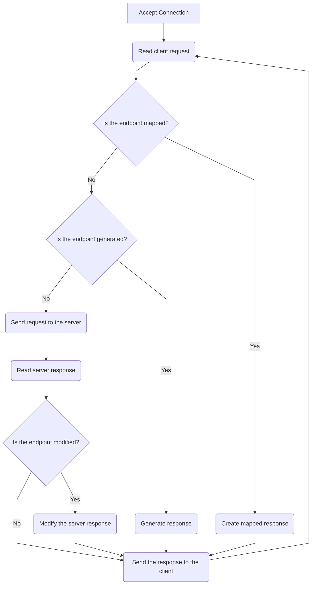

```mermaid
%%{
    init: {
        
        "flowchart": {
            "curve": "linear"
        }
    }
}%%
flowchart TD
Accept[Accept Connection] --> ReadClient(Read client request)
ReadClient --> MappedResponseTest{Is the endpoint mapped?}
MappedResponseTest -->|Yes| MapResponse(Create mapped response)
MappedResponseTest -->|No| GeneratedResponseTest{Is the endpoint generated?}
GeneratedResponseTest -->|Yes| GenerateResponse(Generate response)
GeneratedResponseTest -->|No| RequestServer(Send request to the server)
RequestServer --> ReadServer(Read server response)
ReadServer --> RegexResponseTest{Is the endpoint modified?}
RegexResponseTest --> |Yes| ModifyResponse(Modify the server response)
RegexResponseTest --> |No| SendClient(Send the response to the client)
ModifyResponse --> SendClient
GenerateResponse --> SendClient
MapResponse --> SendClient
SendClient -->ReadClient
```